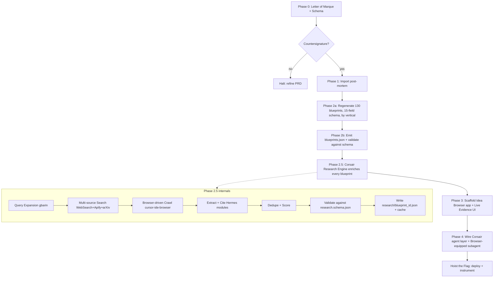

# Corsair Idea Browser Mandate

## 1. Doctrine & Guardrails

- The empty workspace [c:\fAleš\Cursor\Idea_Browser](c:\fAleš\Cursor\Idea_Browser) becomes the sovereign port. All new artifacts live here; the existing `Research and Compile Output Based on Uploaded Context` folder is treated as **source material**, not destination.
- Per Corsair Doctrine, no sailing without a countersigned PRD. **Phase 0 ends with a hard stop** for your countersignature before any code, JSON, or non-markdown edits are made.
- Hybrid reuse confirmed: Phase 1 post-mortem ([phase1_postmortem.md](c:\fAleš\Research and Compile Output Based on Uploaded Context\phase1_postmortem.md)) and Letter of Marque ([corsaro_loi.md](c:\fAleš\Research and Compile Output Based on Uploaded Context\corsaro_loi.md)) are imported verbatim; the 130 blueprints are regenerated fresh under the **15-field CORSAIR schema** (the existing 5-field versions are reference, not source of truth).
- **First-class capability — Corsair Research Engine.** Every blueprint is treated as a live research target, not a static doc. A dedicated agent layer browses the open web, scrapes structured sources, and harvests deep-research evidence (papers, post-mortems, competitor signals, regulatory filings) into a versioned per-blueprint research envelope. The Idea Browser app surfaces this evidence inline (Live Evidence tab) and exposes it as an on-demand `/corsair` deep-research mode.
- Output style honors user rules: concise, table-heavy, executive-ready, no emojis in plan; no markdown tables in this plan body itself.

## 2. Target Workspace Layout

Final structure inside [c:\fAleš\Cursor\Idea_Browser](c:\fAleš\Cursor\Idea_Browser):

- `PRD.md` — the master Letter of Marque + Idea Browser product PRD (the sovereign artifact requiring your countersignature)
- `LETTER_OF_MARQUE.md` — copy of `corsaro_loi.md` plus delta clauses for the Idea Browser scope
- `BLUEPRINT_SCHEMA.md` — strict definition of the 15 required fields (frozen contract before any blueprint is written)
- `phase1/phase1_postmortem.md` — verbatim import (20 failures + 8 archetypes + cross-framework analysis)
- `phase2/blueprints/<vertical>.md` — one markdown file per vertical (13 files, 10 blueprints each, full 15-field schema)
- `phase2/data/blueprints.json` — machine-readable mirror, one record per blueprint, conforming to `schemas/blueprint.schema.json`
- `phase2/data/verticals.json` — vertical metadata + cross-vertical tags
- `phase2/data/failures.json` — Phase 1 archetypes machine-readable, used by the app to render the "Failure Avoidance" backlinks
- `phase2/data/research/<blueprint_id>.json` — per-blueprint research envelope (sources, citations, competitors, signal score, last crawled timestamp, agent trace) emitted by Phase 2.5
- `phase2/data/research/_cache/` — raw fetched HTML/PDF/markdown, content-addressed, gitignored
- `schemas/blueprint.schema.json` — JSON Schema validating every blueprint record (includes `research_envelope` ref)
- `schemas/research.schema.json` — JSON Schema for the research envelope (provenance, confidence, source class, retrieved_at)
- `agents/openclaw/` — DAG definitions (rank-by-moat, synthesize-PRD, expand-billion-dollar-path, stress-test-failure, **research-enrich**, **deep-research**)
- `agents/hermes/` — modular task executors (search, fetch, extract, dedupe, score, cite)
- `agents/research/` — Corsair Research Engine: query expansion, multi-source orchestration, browser-driven crawl, paper harvest, signal scoring
- `app/` — Next.js 14 (App Router) + TypeScript + Tailwind + shadcn/ui Idea Browser app (Phase 3 only)
- `README.md` — operator's quickstart

## 3. Blueprint Schema (the contract that gates everything downstream)

The 15 fields per blueprint, normalized exactly as the CORSAIR doctrine demands:

1. `hook` — one-line compelling vision
2. `core_problem` — unresolved emotional/market pain
3. `emotional_driver` — psychological pull (fear, status, autonomy, belonging, mastery)
4. `ai_leverage` — concrete AI capability and what it replaces
5. `business_model` — type (subscription, marketplace, RaaS, embedded, outcome-based, etc.)
6. `monetization_logic` — pricing structure, take rate, contract shape
7. `distribution_strategy` — GTM channel, PLG/sales-led/community, wedge
8. `retention_loop` — flywheel mechanics (data, network, habit, switching cost)
9. `moat_potential` — defensibility class with rationale
10. `scalability_score` — 1-10 + one-line justification
11. `billion_dollar_path` — concrete expansion arc beyond the wedge
12. `failure_avoidance` — explicit mapping to 1-3 of the 8 archetypes from Phase 1
13. `validation_principle` — Medici | Rothschild | Buffett + one-line invocation
14. `technical_mvp_sketch` — Claude Code + Cursor + OpenClaw/Hermes + GStack + gbarin role assignments (plus perception/control/safety stack for Robotics)
15. `ui_ux_operating_model` — AI-native interaction surface (conversational, agent-mediated, invisible)

A draft `schemas/blueprint.schema.json` enforces field presence, controlled vocabularies (validation_principle, business_model, moat_class, archetype refs), and a 1-10 integer scalability_score.

### 3.1 Research Envelope (added by Phase 2.5)

Each blueprint gains a `research_envelope` object, defined in `schemas/research.schema.json`:

- `last_crawled_at` — ISO timestamp; drives staleness UI badges.
- `signal_score` — 0-100 composite of recency, source diversity, competitor activity, regulatory motion, capital flow into adjacent space.
- `competitors` — array of `{ name, url, status (active|dead|acquired|stealth), funding_usd, founded, one_liner, threat_level }`.
- `citations` — array of `{ url, title, source_class, retrieved_at, snippet, sha256, confidence }` where `source_class ∈ { paper, post_mortem, news, regulatory, vc_thesis, yc_rfs, a16z, founder_writeup, dataset, repo, podcast, social }`.
- `papers` — arXiv/SSRN/Google Scholar harvest with abstract + relevance score.
- `dead_saas_matches` — references into the `dead💀⚰️⚱️ SaaS` corpus where the blueprint's risk profile overlaps a known cadaver.
- `yc_rfs_matches` / `a16z_thesis_matches` — direct anchor links + match rationale.
- `regulatory_landscape` — jurisdiction-tagged summary with citations.
- `agent_trace` — OpenClaw run id + node-by-node log for auditability (HITL).
- `confidence` — overall envelope confidence 0-1.

The envelope is **versioned**: each Phase 2.5 re-crawl appends to a history array so signal drift is observable.

## 4. Corsair Research Engine — Tool Inventory

The Research Engine is the new first-class capability; its tool inventory must be locked before Phase 2.5 sails.

- **Native LLM tools** (already available in this environment):
  - `WebSearch` — real-time web search with date-aware filtering.
  - `WebFetch` — fetch URL → readable markdown for any open page.
- **Browser automation MCP** (`cursor-ide-browser`): full headed browser for sites that require JS, login, or interaction (LinkedIn, Crunchbase, regulatory portals, gated PDFs). Used via the `browser-use` subagent for longer sequences (snapshot → navigate → search → extract).
- **Apify MCP** (`user-apify`): pre-built scrapers for high-signal targets — Crunchbase, LinkedIn, ProductHunt, Reddit, Hacker News, X/Twitter, YouTube.
- **Domain-specific harvesters** built as Hermes modules:
  - arXiv + SSRN search by query + date range; abstract extraction.
  - Google Scholar (via SerpAPI or web search proxy) for high-cited papers.
  - YC RFS scraper (`https://www.ycombinator.com/rfs`) — anchor-level matching.
  - a16z thesis scraper (Big Ideas + Speedrun) — quarterly snapshot.
  - SEC EDGAR + EU regulatory feeds for compliance-sensitive verticals.
  - GitHub trending + repo signal (stars velocity, contributor diversity) per vertical.
  - dead-SaaS corpus is converted to a local vector index for fast cadaver-matching.
- **Memory + cache**:
  - Content-addressed cache under `phase2/data/research/_cache/` keyed by `sha256(url + canonicalized_body)`.
  - TTL per source class: news 24h, vc_thesis 7d, paper 30d, regulatory 7d, post_mortem 365d.
  - `robots.txt` respected; rate-limited per host; user-agent identifies as research bot.
- **Provenance discipline**: every extracted claim in a research envelope must carry a `citation_id` pointing into `citations[]`. Uncited claims are rejected by `research.schema.json` validation.

## 5. Execution Phases & Stop Conditions

### Phase 0 — Letter of Marque & Schema Freeze (markdown only)

- Write `PRD.md` covering: mission, scope, 15-field schema rationale, vertical coverage, **Corsair Research Engine** scope, success metrics, non-goals, governance/HITL checkpoints, app stack proposal.
- Write `LETTER_OF_MARQUE.md` from `corsaro_loi.md` + Idea Browser delta.
- Write `BLUEPRINT_SCHEMA.md` defining each of the 15 fields with examples, controlled vocab, and validation rules.
- Write `RESEARCH_ENGINE_SPEC.md` defining: tool inventory, query expansion strategy, source-class taxonomy + trust hierarchy, scoring algorithm, budget caps, freshness/TTL policy, HITL gates, paywall policy.
- **Hard stop. Request countersignature** on `PRD.md` + `RESEARCH_ENGINE_SPEC.md`. No JSON, no code, no Phase 2 content until approved.

### Phase 1 — Verbatim Imports (markdown only)

- Copy [phase1_postmortem.md](c:\fAleš\Research and Compile Output Based on Uploaded Context\phase1_postmortem.md) into `phase1/phase1_postmortem.md` unchanged.
- Emit `phase2/data/failures.json` as the machine-readable mirror (20 failures + 8 archetypes), referenced by every blueprint's `failure_avoidance` field.

### Phase 2a — Regenerate 130 Blueprints, Vertical by Vertical

- 13 verticals × 10 blueprints × 15 fields. Realistically batched as **one vertical per execution turn** to keep quality high and avoid context collapse:
  - Finance, Insurance, Mobility, Leisure, Home Appliances, Wearables, Travel, Pets, Family, Teenagers, Millennials, Gen-Z, Robotics & Physical AI.
- Each vertical file (`phase2/blueprints/<vertical>.md`) contains the 10 blueprints in the frozen 15-field format.
- Source material:
  - [c:\Users\user\Downloads\dead💀⚰️⚱️ SaaS.pdf](c:\Users\user\Downloads\dead💀⚰️⚱️ SaaS.pdf) — primary failure lens.
  - [c:\Users\user\Downloads\Kimi_Agent_PRD - Copy.pdf](c:\Users\user\Downloads\Kimi_Agent_PRD - Copy.pdf) — agentic UX reference.
  - Existing [MASTER_VENTURE_BLUEPRINTS.md](c:\fAleš\Research and Compile Output Based on Uploaded Context\MASTER_VENTURE_BLUEPRINTS.md) — used only as a hint corpus; new blueprints supersede it.
- Robotics vertical additionally specifies perception stack, control loop, sim env, hardware abstraction, and safety layer per the doctrine.
- Use parallel explore subagents to extract dead-SaaS lessons per vertical so blueprints don't drift from the source.

### Phase 2b — Machine-Readable Corpus

- For each of the 13 vertical files, emit a corresponding record array into `phase2/data/blueprints.json` (130 records total).
- Validate every record against `schemas/blueprint.schema.json`.
- Emit derived indexes: by `validation_principle`, by `business_model`, by `moat_class`, by `failure_avoidance` archetype.

### Phase 2.5 — Corsair Research Engine (live web enrichment)

Goal: every blueprint gets a fresh, cited research envelope before the app is built. Executed as an OpenClaw DAG named `research-enrich`:

1. **Query expansion (gbarin)** — for each blueprint, derive 6-10 targeted queries spanning: market size, named competitors, recent news (last 90d), academic literature, regulatory motion, dead-SaaS analogues, YC RFS overlap, a16z thesis overlap.
2. **Multi-source search fan-out** — parallel calls across `WebSearch`, Apify scrapers, arXiv/SSRN, GitHub trending, SEC EDGAR.
3. **Browser-driven deep crawl** — for results requiring JS/auth/interaction, hand off to the `browser-use` subagent driving the `cursor-ide-browser` MCP (snapshot → navigate → extract). Used sparingly because of latency.
4. **Extraction (Hermes modules)** — convert raw pages → structured `citation` records (title, snippet, source_class, sha256, retrieved_at).
5. **Dedupe + canonicalize** — collapse near-duplicates by URL + content hash; prefer authoritative domains.
6. **Score** — compute `signal_score` (0-100) from: source diversity, recency, competitor density, regulatory activity, capital flow into adjacents.
7. **Validate** — every envelope must pass `schemas/research.schema.json`; failures route to HITL queue.
8. **Persist** — write `phase2/data/research/<blueprint_id>.json`; append to `agent_trace` for auditability.
9. **Cross-link back** — update each blueprint's `failure_avoidance` field with a strengthened cite list pointing at matched dead-SaaS analogues.

Operational guardrails:

- **Budget cap** per blueprint (e.g., 20 search calls, 30 fetches, 5 browser-automated navigations) to prevent runaway cost.
- **Crawl politeness** — robots.txt + 1 req/sec per host + identifying user-agent.
- **Freshness policy** — TTL per source class; stale envelopes flagged in the app with a "Re-run research" CTA.
- **Determinism** — DAGs are seeded; re-runs are reproducible given the same source state.
- **Failure budgets** — if >20% of citations fail validation for a blueprint, the envelope is held in a `needs_review` queue, not auto-published.

### Phase 3 — Idea Browser App Scaffold (after corpus is frozen)

Proposed default stack (override in next turn if preferred):

- Next.js 14 App Router + TypeScript strict + Tailwind + shadcn/ui (matches the user's WEB development rule).
- Data layer: static import of `phase2/data/blueprints.json` + lazy fetch of `phase2/data/research/<id>.json` per blueprint detail page; client-side fuzzy search (Fuse.js) + faceted filtering (vertical, validation principle, moat class, scalability score, failure archetype, **signal_score band**, **freshness**).
- Routes:
  - `/` — armada dashboard, sortable/filterable grid of 130 blueprints (sortable by `signal_score`, `last_crawled_at`, scalability).
  - `/v/[vertical]` — vertical deep-dive with aggregated research signals across all 10 blueprints.
  - `/b/[id]` — single blueprint detail. Tabs:
    - `Blueprint` — the 15 rendered fields with copy-paste-friendly PRD blocks.
    - `Live Evidence` — citations, competitor table, papers, dead-SaaS matches, regulatory landscape, all cited.
    - `Signals` — time-series chart of `signal_score` history + news velocity.
    - `Deep Research` — on-demand "Run Corsair Research" button invokes the research DAG live with streaming agent trace; HITL gate before persisting overwrites.
  - `/failures` — Phase 1 archetypes + 20 post-mortems explorer with backlinks into blueprints that cite them.
  - `/research` — global deep-research surface: free-form prompt → Corsair Browser Agent (browses, cites, synthesizes); results can be saved to a blueprint envelope.
  - `/corsair` — conversational agent surface (chat + tool-calling + browser pane).
- Pages render the 15 fields with copy-paste-friendly PRD blocks and "Hoist the Flag" CTA per blueprint.
- **Live Evidence pane spec**: citation cards grouped by `source_class`, each with title, source domain, retrieved-at, snippet, and "Open in browser" action that pops the `cursor-ide-browser` MCP at that URL for human verification.

### Phase 4 — Corsair Agent Layer

- `agents/openclaw/` — DAGs for: `rank-by-moat`, `synthesize-PRD-from-blueprint`, `expand-billion-dollar-path`, `stress-test-failure-avoidance`, `research-enrich` (Phase 2.5 reused on-demand), `deep-research` (free-form web research from `/research`).
- `agents/hermes/` — modular task executors invoked by the app's `/corsair` and `/research` surfaces (search, fetch, extract, dedupe, score, cite, summarize, compare).
- **Corsair Browser Agent** — long-running browser-equipped subagent built on `cursor-ide-browser` MCP and the platform's `browser-use` subagent type; used for: (a) live competitor walkthroughs, (b) regulatory portal navigation, (c) gated content (PDFs behind paywalls a user is entitled to read), (d) screenshot evidence capture for the Live Evidence pane.
- Conversational UI streams agent traces (OpenClaw node logs) into the chat; tool calls render as inline cards with HITL approval for irreversible actions (writes to corpus, external POSTs, deploys).
- HITL checkpoints enforced at: research envelope overwrite, PRD generation, MVP scaffold, deployment.

## 6. Quality Bar & Guardrails

- Every blueprint must cite at least one of the 8 failure archetypes by ID — enforced by JSON Schema.
- Every blueprint must pick exactly one validation_principle (Medici | Rothschild | Buffett) — no hedging.
- Every research envelope claim must carry a `citation_id`; uncited claims are rejected by `research.schema.json`.
- Crawl politeness enforced: robots.txt respected; per-host rate limits; identifying user-agent; budget caps per blueprint.
- No motivational fluff; doctrine forbids vanity language. Lint pass on each vertical file before commit (regex sweep for banned phrases: "revolutionary", "game-changing", "leverage synergies", etc.).
- 80% test coverage on app components; WCAG 2.1 AA per user rules.
- HITL gates before any irreversible action (corpus overwrite, external POST, deployment).

## 7. Risks & Open Questions (resolve before Phase 0 closes)

- **App stack lock-in**: defaulting to Next.js 14 + shadcn; confirm or override.
- **OpenClaw / Hermes / GStack / gbarin runtime availability**: Phase 4 assumes these are reachable from this workspace (folders exist at `c:\fAleš\Cursor\hermes-agent-main`, `c:\fAleš\EasyClaw`, etc.). Treat as references unless local runtimes are confirmed.
- **Scope of "Idea Browser" as a product**: read-only browser vs. action-capable cockpit (agent can draft a PRD.md per blueprint, scaffold an MVP, run live research). Default proposal: cockpit, but gated by HITL.
- **130 blueprints at full 15-field depth is multi-session work** — plan budgets one vertical per execution turn. Expect ~13 execution turns for Phase 2a alone.
- **Phase 2.5 cost/latency** — running deep research across 130 blueprints could be expensive; need an explicit budget cap (search calls + fetches + browser navigations per blueprint) before launch. Default: 20 searches / 30 fetches / 5 browser navs per blueprint, configurable.
- **Source class trust hierarchy** — need a confirmed precedence (peer-reviewed paper > regulatory filing > YC RFS / a16z thesis > major news > founder writeup > social) for scoring and conflict resolution.
- **Paywalled/auth-gated sources** — agree on policy: skip-by-default, never bypass paywalls; allow user-supplied cookies for sources they're entitled to.

## 8. Immediate Next Action (after this plan is approved)

Execute Phase 0 only:

1. Create `PRD.md`, `LETTER_OF_MARQUE.md`, `BLUEPRINT_SCHEMA.md` inside `Idea_Browser`.
2. Create `RESEARCH_ENGINE_SPEC.md` documenting the tool inventory, query expansion strategy, source class taxonomy, and budget caps (this gives Phase 2.5 a frozen contract before it sails).
3. Copy `phase1_postmortem.md` verbatim into `phase1/`.
4. Halt and request countersignature on `PRD.md` before any Phase 2 work.